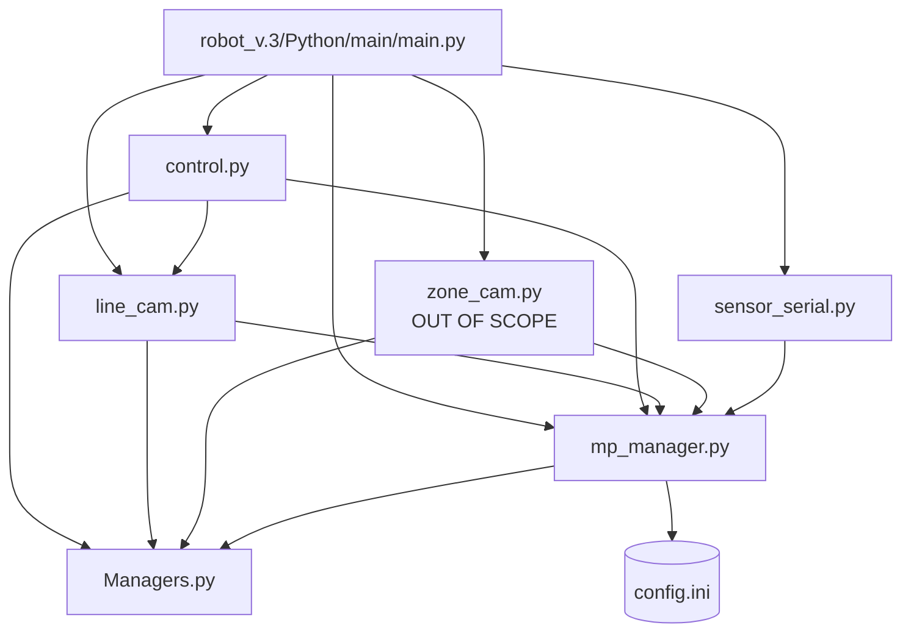

# OE² Reading Dossier — Overengineering² RoboCup Rescue Line Repository

**Purpose.** Single source of truth for a downstream porting agent whose scope is: black-line following, gap crossing, green-marker 90°/180° turns, and red-line stop. Everything else (TPU/YOLO victim detection, evacuation-zone camera, IMU fusion, silver detection, GUI, gripper) is flagged OUT OF SCOPE and only located, not explained.

**Repository:** https://github.com/Overengineering-squared/Overengineering-squared-RoboCup (read from a local clone; all paths repo-relative).

**Read date:** 2026-07-03. All line numbers refer to the files as they exist in the repository at read time.

---

## Section 1 — Repository overview

**What the robot is.** A camera-based RoboCup Junior Rescue Line robot (1st place, World Championship Eindhoven 2024). Compute: 1× Raspberry Pi 5 8GB, 1× Google Coral USB Accelerator, 2× Arduino Nano. Sensors: 2× Adafruit BNO055 IMU, 7× Pololu irs16a/irs17a infrared **distance** sensors (five around the body for obstacle/wall detection, one back, one in the gripper — **there is no IR line-sensor array; line sensing is 100% camera**), Raspberry Pi Camera Module 3 Wide (line camera, facing down ~10 cm above ground), Arducam B0268 wide-angle USB camera (evacuation-zone camera). Actuators: 4× 12 V DC gear motors through one L298N driver (both motors of each side wired to one channel), 6 servos (gripper/storage) driven by the second Arduino Nano, a 12 V LED strip switched by a KY-019 relay, plus a 7" touchscreen for the GUI. Sources: `README.md` (Components section, lines 67–93), `documents/documentation/Team Description Paper.pdf` (Hardware, pp. 6–7; "there is no line array" is confirmed by the Poster's sensor description: "130 cm infrared sensors on each side of the robot, plus two more at the front for obstacle detection, and … a 50 cm infrared sensor on the gripper to confirm victim pickup").

**Critical wiring fact for the port.** The Raspberry Pi drives the L298N **directly from GPIO** (6 pins: 4 direction + 2 PWM via `gpiozero`), see `robot_v.3/Python/main/control.py` lines 59–65 and 1736–1742. The Arduinos are *not* in the motor path. Arduino Nano #1 (`robot_v.3/Arduino/arduino_main/arduino_main.ino`) only *streams sensor data to* the Pi over USB serial. Arduino Nano #2 (`robot_v.3/Arduino/servo_main/servo_main.ino`) receives a 3-bit parallel code + strobe on 4 GPIO lines (not serial) and drives the gripper servos. TDP p. 8 confirms: "The Pi … also controls the 4 DC motors with a direct connection via 6 GPIO pins to the L298N motor driver". Consequence: **there is no Python→Arduino motor serial protocol to port** (details in Section 4); on the target robot the `steer()` function's semantics is the interface to re-implement over serial to the Uno.

**Software architecture at 10,000 feet.** One Python program, `robot_v.3/Python/main/main.py`, launched at boot by `start.sh`. It spawns 4 worker processes (`main.py` lines 595–600) and then runs the CustomTkinter GUI in the main process:

1. `serial_loop` (`sensor_serial.py`) — reads the sensor Nano's USB serial stream, writes values into shared state.
2. `line_cam_loop` (`line_cam.py`) — line camera: black/green/red segmentation, line-point selection, line angle, gap angle, green turn decision, red flag, silver AI. Publishes results as shared scalars.
3. `zone_cam_loop` (`zone_cam.py`) — evacuation-zone camera + YOLOv8 victim detection (OUT OF SCOPE).
4. `control_loop` (`control.py`) — the robot's brain: a state machine that reads the shared scalars and drives the motors via GPIO. This is where line following, gap handling, turns, and red stop are *executed*.

Processes communicate via `multiprocessing.Manager().Value` proxies declared in `robot_v.3/Python/main/mp_manager.py` (imported with `from mp_manager import *` by every module, so all shared variables are module-level globals), plus two `multiprocessing.shared_memory` blocks (`"shm_cam_1"`, `"shm_cam_2"`) that carry annotated camera frames to the GUI (`line_cam.py` line 553, `zone_cam.py` line 108, `main.py` lines 569–581). Full detail in Section 7.

**Live code vs. archive.** Live code is `robot_v.3/` only (`robot_v.3/Python/main/` + `robot_v.3/Arduino/`). `archive/2022_Kassel`, `archive/2023_Hannover`, `archive/2023_Kroatien`, `archive/2023_Old` are previous-year versions — ignore. `robot_v.3/Python/debug/` and `robot_v.3/Python/test/` are standalone bring-up/calibration scripts (a few are useful to the porter; see Section 2). `robot_v.3/Ai/` holds trained models and TPU runtime blobs (OUT OF SCOPE).

**Language & libraries.** Python 3.11 on Raspberry Pi OS Bookworm (`install.sh` line 17 removes `/usr/lib/python3.11/EXTERNALLY-MANAGED`; gpiozero installed by apt because "RPI.GPIO doesn't work with a Pi 5", `install.sh` lines 5–8). Declared deps in `requirements.txt`: `customtkinter`, `opencv-python`, `pillow`, `numba`, `ultralytics`, `numpy<=1.26.4`, `psutil`, `onnx`, `onnxruntime`, `pyserial`, `flatbuffers==23.5.9`, `typing-extensions`, `scikit-image`, `gpiozero`. Used but *not* in `requirements.txt` (ship with Raspberry Pi OS): `picamera2`, `libcamera`. Numba `@njit` accelerates the hot vision functions (`line_cam.py` lines 141, 243; `main.py` line 40). `scikit-image` provides `structural_similarity` for stuck detection (`line_cam.py` line 8).

**Where configuration lives.** Two places. (1) `robot_v.3/Python/main/config.ini` — all color-calibration vectors, read/written at runtime through `ConfigManager` (`Managers.py` lines 8–31, instantiated in `mp_manager.py` line 8) and reloaded by `update_color_values()` (`line_cam.py` lines 68–93). The module-level color constants in `line_cam.py` lines 26–54 are explicitly commented "These are not actually used, but are here for reference". (2) Plain Python constants scattered at module top and inline — GPIO pins, `max_turn_angle`, timers, speeds, morphology iteration counts, ROI fractions (collected exhaustively in Section 5). There are no YAML/env files. `config/user` is a binary dconf blob for the on-screen keyboard (installer artifact, irrelevant).

**Build/launch scripts** (mentioned once, then ignored): `install.sh` (apt+pip setup, Edge-TPU lib), `start.sh` (cd into `robot_v.3/Python/main/` and run `python3 main.py`, logging to `logs/`), `create_autostart.sh` (desktop autostart entry), `update.sh` (pip/apt update).

---

## Section 2 — Curated file list

The live logic is concentrated in 5 Python files + 1 ini + 1 ino, so this list is short. Debug/bring-up scripts that directly help the port are included; everything else is excluded per the exclusion rules.

| File path (relative) | Purpose (1 sentence) | Why the port needs it | Depends on hardware we DON'T have? |
|---|---|---|---|
| `robot_v.3/Python/main/control.py` | State machine + all motor control: line following, gap, turns, red stop, obstacle, zone logic. | Hotspots 2–5 are executed here; `steer()`/`get_speed()` define the motor interface to re-create. | `gpiozero`→L298N direct GPIO (re-target to Uno serial); BNO055 yaw used by `turn_to_angle`/`turn_around` — needs adaptation; IR distance sensors used only by obstacle/seesaw code — can be stubbed. |
| `robot_v.3/Python/main/line_cam.py` | Full line-camera vision pipeline: black/green/red masks, line selection, POIs, line angle, gap angle, green decision, red flag. | Hotspots 1, 3 (detection), 4 (detection+decision), 5 (detection) live here. | `picamera2`/libcamera (line 7) — swap capture backend; Ultralytics silver model (lines 9, 530, 604–616) — must be removed; everything else is pure OpenCV/NumPy/Numba. |
| `robot_v.3/Python/main/mp_manager.py` | Declares every shared variable (Manager proxies) + time-window averaging helpers + gyro fusion. | The shared-variable names are the API between vision and control; `add_time_value`/`get_time_average` are used by all hotspots. | `average_rotation()`/gyro offsets (lines 101–208) are BNO055-only — needs adaptation or removal. |
| `robot_v.3/Python/main/Managers.py` | `ConfigManager` (ini read/write) and `Timer` (named non-blocking timers). | `Timer` is used pervasively by hotspots 1–4; `ConfigManager` loads the color calibration. | No. |
| `robot_v.3/Python/main/config.ini` | Runtime color calibration: black BGR ceilings, green/red HSV ranges (line + zone variants). | Source of the actual competition-tuned thresholds (Section 5). | No. |
| `robot_v.3/Python/main/main.py` | Entry point: spawns the 4 worker processes, then runs the GUI. | Shows process wiring, shared-memory names/sizes, and shutdown protocol; GUI class itself is out of scope. | GUI needs the 1024×600 touchscreen + `resources/robot_model.npz` — strip for the port. |
| `robot_v.3/Python/main/sensor_serial.py` | Reads the sensor Nano's line-oriented serial stream into shared variables. | Only file that shows how serial input is parsed; template for the Uno link. | Parses BNO055/Pololu-specific messages — adapt to new sensor set. |
| `robot_v.3/Arduino/arduino_main/arduino_main.ino` | Sensor Nano firmware: 7× `pulseIn` IR reads + 2× BNO055, printed as text lines every 100 ms. | Documents the exact wire format Python expects (Section 4). | BNO055 + Pololu IR — reference only. |
| `requirements.txt` | Python dependency list. | Reproduce the environment (note `numpy<=1.26.4` for Numba compatibility). | No. |
| `robot_v.3/Python/debug/color_slider.py` | Interactive HSV/BGR threshold slider on the live line camera. | Fastest way to re-derive the Section 5 color thresholds on new hardware/lighting. | `picamera2` — swap capture backend. |
| `robot_v.3/Python/debug/cam_debug_1.py` | Line-camera bring-up: prints sensor modes, shows FPS with the exact production camera config. | Verifies the capture settings (mode 0, LensPosition 6.5, FrameDurationLimits) on new hardware. | `picamera2` — swap capture backend. |
| `robot_v.3/Python/test/steer_test.py` | Keyboard test of the `steer()` function against the live GPIO pin map (RPi.GPIO variant). | Ground truth for motor polarity/pin semantics before porting `steer()` to serial. | RPi GPIO + L298N — reference only. |
| `robot_v.3/Python/debug/serial_debug.py` | 9-line raw serial echo of `/dev/ttyUSB0` at 115200. | Trivial but handy template for the new Uno link. | No. |
| `start.sh` | Boot launcher (mentioned in Section 1; nothing to port). | Only to know the working directory is `robot_v.3/Python/main/` (relative paths in code depend on it). | No. |

**Files deliberately excluded** (one line each, details in Section 8): `zone_cam.py` (evac camera), `robot_v.3/Ai/**` (models/TPU), `servo_main.ino` (gripper servos), GUI body of `main.py` + `resources/**`, `debug/ai_debug.py`, `debug/cam_debug_2*.py`, `debug/take_picture.py`, `debug/move_robot_debug.py` (obsolete pin map 23/24/27/22 ≠ live map), `debug/ir_sensor_calibration/**`, `debug/Timer.py` (near-duplicate of `Managers.Timer`), `test/*` except `steer_test.py`, `archive/**`, installers.

**Note on IR fusion:** line detection does **not** fuse the IR sensors. IR feeds only `obstacle_detected()` / `wall_detected()` / seesaw logic in `control.py` (lines 732–757, 950–951). The gap validator calls `obstacle_detected()` once (`control.py` line 499) and `silver_detected()`; on the target robot these calls can be stubbed to `False`.

---

## Section 3 — The five hotspots, in detail

Shared context for all five: the line camera process (`line_cam.py`, function `line_cam_loop`, lines 527–1106) captures a frame, resizes it to **448×252 BGR** (`camera_x`, `camera_y`, lines 20–21), and — when `objective == "follow_line"` and no calibration is active — runs the block at lines 618–816 every iteration. It publishes scalars (`line_angle`, `line_detected`, `turn_dir`, `red_detected`, `gap_angle`, …) into `mp_manager` shared variables. The control process (`control.py`, function `control_loop`, lines 1731–2310) consumes them at ≤60 Hz. Coordinates: x → right, y → down, origin top-left.

### Hotspot 1 — Line detection (frame → steering error)

**Where:** `robot_v.3/Python/main/line_cam.py`
- thresholding/masking/morphology: inline in `line_cam_loop`, lines 618–724
- contour choice: `determine_correct_line`, lines 198–240
- point-of-interest (POI) extraction: `calculate_angle_numba` (Numba), lines 243–340
- POI → angle decision: `calculate_angle`, lines 343–424, called at line 789

**Stage A — masks (verbatim, `line_cam.py` lines 618–654, comments original):**

```python
if objective.value == "follow_line":
    hsv_image = cv2.cvtColor(cv2_img, cv2.COLOR_BGR2HSV)
    green_image = cv2.inRange(hsv_image, green_min, green_max)
    red_image = cv2.inRange(hsv_image, red_min_1, red_max_1) + cv2.inRange(hsv_image, red_min_2, red_max_2)

    # Adjust black calibration for zone entry
    if line_status.value in ["check_silver", "position_entry", "position_entry_1"]:
        black_image = cv2.inRange(cv2_img, black_min, black_max_silver_validate_bottom_off)
        black_image[0:int(camera_y * .7), 0:camera_x] = cv2.inRange(cv2_img, black_min, black_max_silver_validate_top_off)[0:int(camera_y * .7), 0:camera_x]

    elif line_status.value == "position_entry_2":
        black_image = cv2.inRange(cv2_img, black_min, black_max_silver_validate_bottom_on)
        black_image[0:int(camera_y * .4), 0:camera_x] = cv2.inRange(cv2_img, black_min, black_max_silver_validate_top_on)[0:int(camera_y * .4), 0:camera_x]

    else:
        black_image = cv2.inRange(cv2_img, black_min, black_max_normal_bottom)
        black_image[0:int(camera_y * .4), 0:camera_x] = cv2.inRange(cv2_img, black_min, black_max_normal_top)[0:int(camera_y * .4), 0:camera_x]

    black_image -= green_image
    black_image[black_image < 2] = 0

    # Change black_max to black_max_ramp_down_top if the top section of the image is too dark
    dark_ahead = False
    black_mean = round(np.mean(black_image[0:int(camera_y * .25), 0:camera_x]), 2)
    if black_mean > 90 and not line_status.value == "check_silver":
        black_image_2 = cv2.inRange(cv2_img, black_min, black_max_ramp_down_top)
        black_image_2 -= green_image
        black_image_2[black_image_2 < 2] = 0

        black_mean_2 = round(np.mean(black_image_2[0:int(camera_y * .25), 0:camera_x]), 2)

        if black_mean_2 + 30 < black_mean:  # 20
            cv2.circle(cv2_img, (10, 10), 5, (0, 0, 0), -1, cv2.LINE_AA)
            black_image[0:int(camera_y * .4), 0:camera_x] = black_image_2[0:int(camera_y * .4), 0:camera_x]
            dark_ahead = True

    ramp_ahead.value = dark_ahead
```

Walkthrough: green and red are segmented in HSV. Black is segmented by `cv2.inRange` **on the raw BGR image** (not HSV, not grayscale) against per-channel ceilings, with a *split threshold*: rows 0–40% of the image (far field) use a stricter ceiling (`black_max_normal_top`) than rows 40–100% (near field, `black_max_normal_bottom`), compensating for the LED strip lighting the near field. Green pixels are subtracted from black so a green marker never reads as line. If the top quarter of the black mask averages > 90 (i.e., a huge dark area ahead — the wooden floor seen past a ramp-down edge), the code retries the top 40% with the much darker `black_max_ramp_down_top` ceiling and, if that removes ≥30 mean-units of mass, uses it and sets `ramp_ahead` (which slows the robot; see Hotspot 2).

After the masks: `black_average` (mean of the whole black mask) is published (line 656); every 30th frame a structural-similarity score against the previous saved mask is published as `line_similarity` (stuck detection, lines 659–663); state-dependent rectangles blank out image regions (obstacle/gap states, lines 666–682 — the gap one is quoted in Hotspot 3); noise reduction is `erode×5 → dilate×17 → erode×9` with a 3×3 ones kernel for black, `erode×1 → dilate×11 → erode×9` for green and red (lines 684–703). Contours are extracted with `cv2.findContours(..., cv2.RETR_LIST, cv2.CHAIN_APPROX_NONE)` and black contours smaller than `min_line_size.value` (default 3000 px², a shared variable retuned by the gap/obstacle code) are discarded (lines 714–721).

**Stage B — choosing which black contour is "the line" (verbatim, `determine_correct_line`, lines 198–233; the remaining lines 235–240 are GUI drawing calls and `return blackline, blackline_crop`):**

```python
def determine_correct_line(contours_blk):
    global x_last, y_last
    candidates = np.zeros((len(contours_blk), 5), dtype=np.int32)
    off_bottom = 0

    for i, contour in enumerate(contours_blk):
        box = cv2.boxPoints(cv2.minAreaRect(contour))
        box = box[box[:, 1].argsort()[::-1]]  # Sort them by their y values and reverse
        bottom_y = box[0][1]
        y_mean = (np.clip(box[0][1], 0, camera_y) + np.clip(box[3][1], 0, camera_y)) / 2

        if box[0][1] >= (camera_y * 0.75):
            off_bottom += 1

        box = box[box[:, 0].argsort()]
        x_mean = (np.clip(box[0][0], 0, camera_x) + np.clip(box[3][0], 0, camera_x)) / 2
        x_y_distance = abs(x_last - x_mean) + abs(y_last - y_mean)  # Distance between the last x/y and current x/y

        candidates[i] = i, bottom_y, x_y_distance, x_mean, y_mean

    if off_bottom < 2:
        candidates = candidates[candidates[:, 1].argsort()[::-1]]  # Sort candidates by their bottom_y
    else:
        off_bottom_candidates = candidates[np.where(candidates[:, 1] >= (camera_y * 0.75))]
        candidates = off_bottom_candidates[off_bottom_candidates[:, 2].argsort()]

    if turn_dir.value == "left":
        x_last = np.clip(candidates[0][3] - 150, 0, camera_x)
    elif turn_dir.value == "right":
        x_last = np.clip(candidates[0][3] + 150, 0, camera_x)
    else:
        x_last = candidates[0][3]

    y_last = candidates[0][4]
    blackline = contours_blk[candidates[0][0]]
    blackline_crop = blackline[np.where(blackline[:, 0, 1] > camera_y * line_crop.value)]
```

Walkthrough: every surviving contour is scored by (a) the y of the lowest corner of its min-area rectangle and (b) the L1 distance of its center to the previously followed contour (`x_last`, `y_last`, initialized to image center at process start, lines 532–533). If fewer than two contours reach the bottom 25% of the frame, the contour reaching lowest wins (the line under the robot). If two or more reach the bottom (fork/intersection ambiguity), the one closest to the last-tracked position wins — temporal continuity. When a green turn is latched (`turn_dir` left/right, Hotspot 4), `x_last` is biased 150 px toward the turn side so the tracker prefers the branch in the turn direction on the next frame. Finally the chosen contour is also cropped to points **below** `camera_y * line_crop` (`line_crop` defaults to 0.6 and is retuned continuously: 0.48 normal, 0.45 during green turns, 0.75 on ramps — `line_cam.py` lines 744–758), giving a near-field sub-contour `blackline_crop`.

**Stage C — POIs and the steering error.** `calculate_angle_numba` (lines 243–340) extracts, for the full contour, the mean top point, bottom point, leftmost and rightmost points (`poi_no_crop = [t, l, r, b]`), and the same top/left/right for the cropped contour (`poi`). Two special cases: (1) if the top row of the contour has a horizontal gap > `max_gap = 1` px, the top is split into two candidate tops and the one nearest the time-averaged projected line x (`average_line_point`) is used — this handles intersections where two branches touch the top; (2) if the bottom row splits into two segments > 80 px apart, the second bottom point is stored in `poi_no_crop[3]` — this is the *sharp-turn detector* (a second line limb entering at the bottom edge; Engineering Journal p. 102 describes the rationale: "looking for a contour of the black line that touches the bottom edge of the camera frame at two different positions"). It also reports `max_black_top` = cropped-top width > `camera_x * .19` (a wide blob at the crop top, i.e., an intersection crossbar).

**Decision cascade (verbatim, `calculate_angle`, lines 343–424; blank lines compressed, no statements removed):**

```python
def calculate_angle(blackline, blackline_crop, average_line_angle, turn_direction, last_bottom_point, average_line_point, entry):
    global multiple_bottom_side

    poi, poi_no_crop, is_crop, max_black_top, bottom_point = calculate_angle_numba(blackline, blackline_crop, last_bottom_point, average_line_point)

    black_top = poi_no_crop[0][1] < camera_y * .1

    multiple_bottom = not (poi_no_crop[3][0] == 0 and poi_no_crop[3][1] == 0)

    black_l_high = poi_no_crop[1][1] < camera_y * .5
    black_r_high = poi_no_crop[2][1] < camera_y * .5

    if entry:
        final_poi = poi_no_crop[0]

    elif not timer.get_timer("multiple_bottom"):
        final_poi = [multiple_bottom_side, camera_y]

    elif turn_direction in ["left", "right"]:
        index = 1 if turn_direction == "left" else 2
        final_poi = poi[index] if is_crop else poi_no_crop[index]

    else:
        if black_top:
            final_poi = poi[0] if is_crop and not max_black_top else poi_no_crop[0]

            if (poi_no_crop[1][0] < camera_x * 0.02 and poi_no_crop[1][1] > camera_y * (line_crop.value * .75)) or (poi_no_crop[2][0] > camera_x * 0.98 and poi_no_crop[2][1] > camera_y * (line_crop.value * .75)):
                final_poi = poi_no_crop[0]

                if black_l_high or black_r_high:
                    near_high_index = 0
                    if black_l_high and not black_r_high:
                        near_high_index = 1
                    elif not black_l_high and black_r_high:
                        near_high_index = 2
                    elif black_l_high and black_r_high:
                        if np.abs(poi_no_crop[1][0] - average_line_point) < np.abs(poi_no_crop[2][0] - average_line_point):
                            near_high_index = 1
                        else:
                            near_high_index = 2

                    if np.abs(poi_no_crop[near_high_index][0] - average_line_point) < np.abs(poi_no_crop[0][0] - average_line_point):
                        final_poi = poi_no_crop[near_high_index]

        else:
            final_poi = poi[0] if is_crop else poi_no_crop[0]

            if poi_no_crop[1][0] < camera_x * 0.02 and poi_no_crop[2][0] > camera_x * 0.98 and timer.get_timer("multiple_side_r") and timer.get_timer("multiple_side_l"):
                if average_line_angle >= 0:
                    index = 2
                    timer.set_timer("multiple_side_r", .6)
                else:
                    index = 1
                    timer.set_timer("multiple_side_l", .6)
                final_poi = poi[index] if is_crop else poi_no_crop[index]

            elif not timer.get_timer("multiple_side_l"):
                final_poi = poi[1] if is_crop else poi_no_crop[1]

            elif not timer.get_timer("multiple_side_r"):
                final_poi = poi[2] if is_crop else poi_no_crop[2]

            elif poi_no_crop[1][0] < camera_x * 0.02:
                final_poi = poi[1] if is_crop else poi_no_crop[1]

            elif poi_no_crop[2][0] > camera_x * 0.98:
                final_poi = poi[2] if is_crop else poi_no_crop[2]

            elif multiple_bottom and timer.get_timer("multiple_bottom"):
                if poi_no_crop[3][0] < bottom_point[0]:
                    final_poi = [0, camera_y]
                    multiple_bottom_side = 0
                else:
                    final_poi = [camera_x, camera_y]
                    multiple_bottom_side = camera_x
                timer.set_timer("multiple_bottom", .6)

    return int((final_poi[0] - camera_x / 2) / (camera_x / 2) * 180), final_poi, bottom_point
```

Walkthrough, in priority order: (1) during zone-entry positioning, just follow the full-frame top point; (2) if the sharp-turn latch is active (`multiple_bottom` timer running), aim hard at the bottom corner on the side where the second limb appeared (error saturates at ±180); (3) if a green turn is latched, follow the leftmost/rightmost point of the (cropped) contour — this *is* the 90° turn mechanism; (4) otherwise follow the top point of the cropped contour, with overrides: if the line hugs a left/right frame edge low in the frame, or touches both edges (T-crossbar), fall back to the full-frame top or the left/right point nearest the time-averaged line position, latching side-following for 0.6 s via the `multiple_side_*` timers. The TDP (p. 8, "Line detection algorithm") describes exactly this: follow the highest point of the cropped image; use leftmost/rightmost near edges to avoid overrunning; at angled intersections use the extrapolated "yellow point" (the `average_line_point` projection, computed at `line_cam.py` lines 795–801 by extending the bottom→POI vector to y=0 and time-averaging it over 0.15 s).

**Output:** `line_angle.value` = `int((final_poi_x − 224) / 224 × 180)` ∈ [−180, +180]. It is a **scaled horizontal pixel offset**, not a geometric angle. Also published: `line_angle_y` (POI y), `line_detected`, `line_size` (contour area), `bottom_point` history. **Inputs:** 448×252 BGR frame; previous state = `x_last`/`y_last`, `turn_dir`, `line_crop`, `min_line_size`, 0.3 s-averaged angle, 0.15 s-averaged bottom-x and projected-x. **Failure modes handled:** no contour ⇒ `line_detected=False`, `line_angle=0`, `line_size=0`, `line_angle_y=-1`, gap values reset (lines 809–816 — the control process then triggers gap handling, Hotspot 3); ambiguous forks ⇒ temporal-continuity choice; intersections ⇒ POI overrides above; too-dark far field ⇒ ramp threshold swap.

### Hotspot 2 — Line following control (error → motor commands)

**Where:** `robot_v.3/Python/main/control.py`
- actuator primitive: `steer(angle, speed)`, lines 134–187
- speed scheduler: `get_speed(angle)`, lines 260–297
- the loop that binds them: `control_loop`, `"line_detected"` branch, lines 1913–1929

**There is no PID.** It is a proportional steering law embedded in `steer()`: the outer wheel runs at `speed`, the inner wheel is scaled down linearly with |error|; beyond ±`max_turn_angle` (110) it switches to an on-the-spot pivot at 1.2× speed. On top sits a state machine (`line_status`) — everything else in this dossier (gap, red, obstacle) is just other states of that machine.

**Verbatim, `steer()` (lines 134–187):**

```python
def steer(angle=190., speed=0.8):
    speed_left.value = 0
    speed_right.value = 0

    # stop
    if angle == 190:
        forward_right.off()
        backward_right.off()
        forward_left.off()
        backward_left.off()
        speed_left.value = 0
        speed_right.value = 0

    # backward
    elif angle == 200:
        forward_right.on()
        backward_right.off()
        forward_left.on()
        backward_left.off()
        speed_left.value = max(speed * left_correction, 0)
        speed_right.value = max(speed * right_correction, 0)

    # forward
    elif angle in range(-180, 181):
        forward_right.off()
        backward_right.on()
        forward_left.off()
        backward_left.on()

        # right
        if angle >= 0:
            if angle > max_turn_angle:
                forward_right.on()
                backward_right.off()
                forward_left.off()
                backward_left.on()
                speed_left.value = min(speed * left_correction * 1.2, 1)
                speed_right.value = min(speed * right_correction * 1.2, 1)
            else:
                speed_left.value = min(speed * left_correction, 1)
                speed_right.value = min(speed * right_correction * ((max_turn_angle - angle) / (max_turn_angle - 1)), 1)

        # left
        else:
            if angle < -max_turn_angle:
                forward_right.off()
                backward_right.on()
                forward_left.on()
                backward_left.off()
                speed_left.value = min(speed * left_correction * 1.2, 1)
                speed_right.value = min(speed * right_correction, 1)
            else:
                speed_left.value = min(speed * left_correction * ((max_turn_angle + angle) / (max_turn_angle - 1)), 1)
                speed_right.value = min(speed * right_correction, 1)
```

Command vocabulary: `angle == 190` ⇒ full stop (all direction pins off, PWM 0). `angle == 200` ⇒ drive backward at `speed`. `angle ∈ [−180, 180]` ⇒ drive forward, positive = steer right, negative = steer left. |angle| ≤ 110 ⇒ arc: inner wheel PWM = `speed × (110 − |angle|)/109`, reaching ~0 at |angle| = 110. |angle| > 110 ⇒ pivot in place at `min(speed × 1.2, 1)` on both wheels. `speed` is PWM duty 0..1 (`PWMLED` at 1000 Hz, line 1741). `left_correction = right_correction = 1` (lines 76–77). ⚠️ Note the pin-name inversion: driving *forward* energizes the pins named `backward_*`; the `# backward` branch energizes `forward_*` — the GPIO variable names disagree with actual motion labels (comments at lines 60–63 also disagree with the `# backward`/`# forward` branch labels). The branch comments (`# stop`, `# backward`, `# forward`) describe the intended motion; the porter must verify polarity on the target robot (see Section 9, item 1).

**Verbatim, the actual line-following loop body (`control_loop`, lines 1913–1929):**

```python
                    # still line detected
                    if line_status.value == "line_detected":
                        if turn_dir.value == "turn_around":
                            status.value = f'Turning around {"right" if last_turn_dir == "r" else "left"}'

                            last_turn_dir = turn_around()
                            continue

                        status.value = f'Following Line'

                        steer(line_angle.value, get_speed(line_angle.value))

                        time_silver_detected = add_time_value(time_silver_detected, silver_value.value)
                        time_last_angles = add_time_value(time_last_angles, line_angle.value)

                        if get_time_average(time_line_similarity, 15) > .88 and timer.get_timer("stuck_cooldown"):
                            avoid_stuck()
                            timer.set_timer("stuck_cooldown", 4 if rotation_y.value == "none" else 8)
```

One call per loop iteration (≤60 Hz): `steer(line_angle, get_speed(line_angle))`. `get_speed` (lines 260–297) returns **1.0 (full PWM) on flat ground**; it reduces speed only on ramps (via IMU-derived `rotation_y`) or when a ramp is ahead (`ramp_ahead` from Hotspot 1): ramp_up ⇒ 0.9 (0.75 if pivoting; lower again if recently stuck), ramp_down ⇒ 0.3 straight / 0.65 arc / 0.85 pivot (much lower after a stuck event), `ramp_ahead` ⇒ 0.3–0.65 for 2 s. On a target robot without an IMU, `get_speed` degenerates to `return 1` plus the `ramp_ahead` branch, which is camera-only and portable.

**Stuck recovery (failure mode):** if the 15 s average of `line_similarity` (SSIM between consecutive black masks, Hotspot 1) exceeds 0.88, `avoid_stuck()` (lines 980–1008) runs an open-loop jiggle: if the error was large (|angle| > 120) — stop 1 s, counter-turn 0.35 s, forward 0.45 s, re-turn 0.45 s, reverse 0.5 s; on ramp-down — stop then forward 0.5 s; else just stop 0.5 s; then sets a `stuck_detected` timer that temporarily lowers ramp speeds in `get_speed`.

**Inputs:** `line_angle` ∈ [−180, 180] (Hotspot 1), `rotation_y`/`ramp_ahead`, timers. **Outputs:** 4 direction GPIO levels + 2 PWM duties (pins 0, 1, 5, 6 / 12, 13 BCM — `control.py` lines 59–65). **Rate:** capped at 60 iterations/s (lines 1766, 2296–2298); vision updates arrive at ~35–40 fps (TDP p. 7), so the same angle is often acted on twice.

### Hotspot 3 — Gap crossing

**Where (runtime call order):**
1. trigger: `control.py` lines 1887–1888 (state `line_detected` → `gap_detected`)
2. gap geometry: `line_cam.py` `get_gap_angle` lines 427–437, applied in-loop lines 766–778
3. orientation routine: `control.py` `orientate_gap`, lines 481–676 (helpers `drive_back_until_line` lines 452–464, `ensure_line_detected` lines 467–478)
4. blind crossing: `control.py` state `gap_avoid`, lines 1952–1972, with image masking in `line_cam.py` lines 676–678 and 689–691

**Trigger (verbatim, `control.py` lines 1885–1888):**

```python
                    # detected line on last frame
                    if line_status.value == "line_detected":

                        if not line_detected.value and rotation_y.value == "none" and not ramp_ahead.value:
                            line_status.value = "gap_detected"
```

The gap state machine starts the moment the camera loses all black contours ≥ `min_line_size` while the robot is level. (On the target robot without an IMU, `rotation_y` is permanently `"none"` and this reduces to `not line_detected and not ramp_ahead`.)

**Gap geometry (verbatim, `line_cam.py` lines 427–437 and 766–778):**

```python
def get_gap_angle(box):
    box = box[box[:, 1].argsort()]

    vector = box[0] - box[1]
    angle = np.arccos(np.dot(vector, [1, 0]) / (np.linalg.norm(vector) * np.linalg.norm([1, 0]))) * 180 / np.pi
    angle = angle if box[0][0] < box[1][0] else -angle

    if angle == 180:
        angle = 0

    return box[0], box[1], angle
```

```python
                        # Calculate the gap angle 
                        if line_status.value == "gap_detected":
                            p1, p2, angle = get_gap_angle(cv2.boxPoints(cv2.minAreaRect(blackline)))
                            if p1[1] < camera_y * 0.95 and p2[1] < camera_y * 0.95:
                                gap_angle.value = angle

                                center_gap_ponit = (p1 - p2) / 2 + p2

                                gap_center_x.value = int((center_gap_ponit[0] - camera_x / 2) / (camera_x / 2) * 180)
                                gap_center_y.value = center_gap_ponit[1]
```

While in `gap_detected`, the camera process fits a min-area rectangle around the (re-found, after reversing) line stub, takes its two **highest** corners, and publishes: `gap_angle` = angle of that top edge vs. horizontal (0° = line end is square to the robot), and `gap_center_x/y` = the top edge's midpoint (x scaled to ±180 like the line angle). Both corners must be above the bottom 5% of the frame. This is the Engineering Journal's 2024-01-09 entry (p. 91): "the angle of the upper side of the line to the horizontal axis … repositioning program until this angle is 0°" — i.e., square up against the line *end*, then drive straight across the gap.

**Orientation routine — the core loop (excerpt, `control.py` lines 511–588; the function continues with a symmetric lateral-correction block to line 643):**

```python
    update_sensor_average()
    if line_detected.value and black_average.value < 40 and not silver_detected():
        status.value = f'Orientating at gap'

        angle = gap_angle.value
        x_gap = gap_center_x.value
        y_gap = gap_center_y.value

        correction_counter = 0
        while correction_counter < 7:

            if y_gap < 10:
                return False

            time_foreward = .25

            if (0 < angle < 173 and x_gap < 0) or (angle < -7 and x_gap > 0) or (0 < angle < 155) or (angle < -25):
                min_time = .35

                if (0 < angle < 173 and x_gap < 0) or (angle < -7 and x_gap > 0):
                    x_gap_perc = pow(abs(x_gap) / (180 + 40), .7)
                else:
                    x_gap_perc = 0

                y_gap_perc = y_gap / camera_y

                if angle > 0:
                    angle_perc = (angle - 90) / 90
                else:
                    angle_perc = abs(-angle / 90)

                time_foreward = min_time + .3 * x_gap_perc + .1 * y_gap_perc + .3 * angle_perc

            if not (0 >= angle > -1 or angle > 179):
                steer(0, .7)
                time.sleep(time_foreward)

                if not program_continue():
                    return False

                if angle > 0:
                    steer(180, .65)
                    time.sleep(abs(.9 - .85 * ((angle - 90) / 90)))
                else:
                    steer(-180, .65)
                    time.sleep(abs(.05 + .85 * abs(-angle / 90)))

                steer()

                if not program_continue():
                    return False

                min_line_size.value = 9000
                steer(200, .7)
                time.sleep(time_foreward + np.clip(((time_foreward - .25) / .4) * .15, 0, .15))

                if not drive_back_until_line(.6, .7):
                    return False

                if line_size.value > 17000:
                    steer(200, .7)
                    time.sleep(.2)
                    steer()
                    return False

            if not ensure_line_detected() or not program_continue():
                return False

            angle = gap_angle.value
            x_gap = gap_center_x.value

            if y_gap < 10:
                return False

            if abs(x_gap) > 55:
                steer(180 if x_gap > 0 else -180, .6)
                time.sleep(.4)
                steer()
```

Full sequence of `orientate_gap()` in plain English:

1. **Validate** (lines 483–509): if no line (or a tiny one, `line_size < 17000`) and no silver: reverse 0.15 s, stop; abort if silver appears (zone entrance, not a gap) or an obstacle is in front; reverse 0.3 s more (+0.2 s if line still missing), nudge forward 0.25 s. Purpose: back up until the line stub is visible again.
2. **Square up** (lines 512–643, quoted above): up to **7 correction cycles**. Each cycle: if the stub's top edge is < 10 px from the frame top (`y_gap < 10`), give up (the line goes to the frame edge — not a gap). Compute a forward time from three normalized errors (lateral `x_gap`, height `y_gap`, angular `angle`), drive forward that long, pivot toward square (sleep time interpolated from the angle: right turns `0.9 − 0.85·(angle−90)/90` s, left turns `0.05 + 0.85·|angle|/90` s at speed 0.65), then reverse the same distance (with `min_line_size` raised to 9000 so noise can't hijack the tracker) and reverse further until the line reappears (`drive_back_until_line`, max 0.6 s). If what reappears is huge (`line_size > 17000` — a full line, not a stub) the "gap" was a false positive: reverse 0.2 s and abort. Then a second, analogous block (lines 585–628) fixes pure lateral offset when `|x_gap| > 55` (pivot 0.4 s, drive, pivot back, reverse to line). Loop exits when `angle ∈ (−1, 0] or angle > 179` **and** `|x_gap| < 140` — squared up within ~1°.
3. **Commit** (lines 638–643): set `line_status = "gap_avoid"`, `min_line_size = 4000`, drive straight 0.8 s at speed 0.7 (this alone crosses small gaps).
4. **Abort paths:** too much black (`black_average > 40` — not a gap, probably an intersection shadow) or silver ⇒ reverse 0.2 s, back to `line_detected` (lines 645–651). No line at all after validation ⇒ **search sweep** (lines 653–676): gyro-turn +45° right, then 90° left (each aborting early if black appears: `turn_to_angle(..., stop_on_black=True)`), return to start heading, then creep forward up to 1.2 s looking for the line. ⚠️ The sweep uses the IMU (`turn_to_angle`); on an IMU-less target it must be re-implemented (timed turns).

**Blind crossing (verbatim, `control.py` lines 1952–1972):**

```python
                    elif line_status.value == "gap_avoid":
                        status.value = f'Avoiding gap'

                        if line_detected.value or silver_detected() or obstacle_detected():
                            min_line_size.value = 3000
                            line_status.value = "line_detected"
                            timer.set_timer("stuck_cooldown", 4)
                            continue
                        else:
                            steer(0, .6)

                        if timer.get_timer("gap_avoid"):
                            min_line_size.value = 4500
                            steer(200, .6)
                            time.sleep(1.35)
                            drive_back_until_line(.3, .6)

                            line_status.value = "line_detected"
                            time.sleep(.1)
                            timer.set_timer("stuck_cooldown", 4)
                            continue
```

While `gap_avoid` is active the camera masks out the left and right 35% of the image (`line_cam.py` lines 676–678: `cv2.rectangle(black_image, (0, 0), (int(camera_x * .35), camera_y), 0, -1)` and mirror) and uses lighter morphology (erode×5/dilate×8, lines 689–691), so only a line appearing dead ahead can end the crossing. The robot drives straight at 0.6 until the line (or silver/obstacle) appears. If the `gap_avoid` timer (0.4 s, set at commit) expires with nothing found, it reverses 1.35 s + up to 0.3 s more until the line is re-found, then returns to `line_detected` (which will immediately re-trigger `gap_detected` — the whole procedure retries).

**Inputs:** `line_detected`, `line_size`, `black_average`, `gap_angle`, `gap_center_x/y`, silver/obstacle predicates, IMU yaw (sweep only). **Outputs:** open-loop `steer()` sequences; state transitions; retuned `min_line_size`. **Failure modes:** every `return False` path above (silver, obstacle, `y_gap < 10`, oversized line, 7-correction exhaustion, lost line) drops back to `line_detected` with `min_line_size` restored to 3000 — the system deliberately re-enters gap handling on the next frame if the line is still missing.

### Hotspot 4 — Green marker detection and 90°/180° turn logic

**Where (runtime call order):**
1. blob detection + validation: `line_cam.py` `check_green` lines 115–138, `check_black` (Numba) lines 141–175, `determine_turn_direction` lines 178–195, called at lines 727–730
2. temporal latching: `line_cam.py` lines 732–758
3. 90° execution: via Hotspot 1's POI override (`calculate_angle` lines 361–363) + tracker bias (`determine_correct_line` lines 224–229) + `line_crop` 0.45
4. 180° execution (double green): `control.py` `turn_around`, lines 679–729, dispatched at lines 1914–1918

**Detection + validation (verbatim, `line_cam.py` lines 115–195, drawing calls trimmed):**

```python
def check_green(contours_grn, black_image):
    black_around_sign = np.zeros((len(contours_grn), 5), dtype=np.int16)  # [[b,t,l,r,lp], [b,t,l,r,lp]]

    for i, contour in enumerate(contours_grn):
        area = cv2.contourArea(contour)
        if area <= 2500:
            continue

        green_box = cv2.boxPoints(cv2.minAreaRect(contour))
        black_around_sign = check_black(black_around_sign, i, green_box, black_image.copy())

    turn_left, turn_right, left_bottom, right_bottom = determine_turn_direction(black_around_sign)

    if turn_left and not turn_right and not left_bottom:
        return "left"
    elif turn_right and not turn_left and not right_bottom:
        return "right"
    elif turn_left and turn_right and not (left_bottom and right_bottom):
        return "turn_around"
    else:
        return "straight"


@njit(cache=True)
def check_black(black_around_sign, i, green_box, black_image):
    green_box = green_box[green_box[:, 1].argsort()]

    marker_height = green_box[-1][1] - green_box[0][1]

    black_around_sign[i, 4] = int(green_box[2][1])

    # Bottom
    roi_b = black_image[int(green_box[2][1]):np.minimum(int(green_box[2][1] + (marker_height * 0.8)), camera_y), np.minimum(int(green_box[2][0]), int(green_box[3][0])):np.maximum(int(green_box[2][0]), int(green_box[3][0]))]
    if roi_b.size > 0:
        if np.mean(roi_b[:]) > 125:
            black_around_sign[i, 0] = 1

    # Top
    roi_t = black_image[np.maximum(int(green_box[1][1] - (marker_height * 0.8)), 0):int(green_box[1][1]), np.minimum(np.maximum(int(green_box[0][0]), 0), np.maximum(int(green_box[1][0]), 0)):np.maximum(np.maximum(int(green_box[0][0]), 0), np.maximum(int(green_box[1][0]), 0))]
    if roi_t.size > 0:
        if np.mean(roi_t[:]) > 125:
            black_around_sign[i, 1] = 1

    green_box = green_box[green_box[:, 0].argsort()]

    # Left
    roi_l = black_image[np.minimum(int(green_box[0][1]), int(green_box[1][1])):np.maximum(int(green_box[0][1]), int(green_box[1][1])), np.maximum(int(green_box[1][0] - (marker_height * 0.8)), 0):int(green_box[1][0])]
    if roi_l.size > 0:
        if np.mean(roi_l[:]) > 125:
            black_around_sign[i, 2] = 1

    # Right
    roi_r = black_image[np.minimum(int(green_box[2][1]), int(green_box[3][1])):np.maximum(int(green_box[2][1]), int(green_box[3][1])), int(green_box[2][0]):np.minimum(int(green_box[2][0] + (marker_height * 0.8)), camera_x)]
    if roi_r.size > 0:
        if np.mean(roi_r[:]) > 125:
            black_around_sign[i, 3] = 1

    return black_around_sign


def determine_turn_direction(black_around_sign):
    turn_left = False
    turn_right = False
    left_bottom = False
    right_bottom = False

    for i in black_around_sign:
        if np.sum(i[:4]) == 2:
            if i[1] == 1 and i[2] == 1:
                turn_right = True
                if i[4] > camera_y * 0.95:
                    right_bottom = True
            elif i[1] == 1 and i[3] == 1:
                turn_left = True
                if i[4] > camera_y * 0.95:
                    left_bottom = True

    return turn_left, turn_right, left_bottom, right_bottom
```

Walkthrough: the green HSV mask (`green_min`/`green_max`, morphed erode×1/dilate×11/erode×9) is contoured. Every green blob with area > **2500 px²** gets a min-area box; four rectangular ROIs of size `0.8 × marker_height` are sampled from the **black mask** directly below, above, left of, and right of the box; an ROI whose mean exceeds **125** (≥ ~49% black pixels) counts as "black on that side". A *valid intersection marker* must have black on **exactly 2 of 4 sides**, one of which is the top (the crossbar): black top+left ⇒ the marker sits right of the line ⇒ `turn_right`; black top+right ⇒ `turn_left`. Markers whose box bottom is in the lowest 5% of the frame (`i[4] > camera_y * 0.95`) set `left/right_bottom`, which *suppresses* the turn (marker already under the robot — too late to act). Both directions valid simultaneously ⇒ `turn_around` (double green). Anything else ⇒ `straight`.

**Temporal latching (verbatim, `line_cam.py` lines 732–758):**

```python
                    time_turn_direction = add_time_value(time_turn_direction, average_direction(turn_direction))
                    avg_turn_dir = get_time_average(time_turn_direction, .2)

                    if avg_turn_dir > .1 and not rotation_y.value == "ramp_up":
                        timer.set_timer("right_marker", .5)
                    elif avg_turn_dir > .1 and rotation_y.value == "ramp_up":
                        timer.set_timer("right_marker_up", .8)
                    elif avg_turn_dir < -.1 and not rotation_y.value == "ramp_up":
                        timer.set_timer("left_marker", .5)
                    elif avg_turn_dir < -.1 and rotation_y.value == "ramp_up":
                        timer.set_timer("left_marker_up", .8)

                    if (not timer.get_timer("right_marker") or not timer.get_timer("right_marker_up")) and not turn_direction == "turn_around" and avg_turn_dir >= 0 and rotation_y.value != "ramp_up":
                        turn_dir.value = "right"
                        line_crop.value = .45
                    elif (not timer.get_timer("right_marker") or not timer.get_timer("right_marker_up")) and not turn_direction == "turn_around" and avg_turn_dir >= 0 and rotation_y.value == "ramp_up":
                        turn_dir.value = "right"
                        line_crop.value = .75
                    elif (not timer.get_timer("left_marker") or not timer.get_timer("left_marker_up")) and not turn_direction == "turn_around" and avg_turn_dir <= 0 and rotation_y.value != "ramp_up":
                        turn_dir.value = "left"
                        line_crop.value = .45
                    elif (not timer.get_timer("left_marker") or not timer.get_timer("left_marker_up")) and not turn_direction == "turn_around" and avg_turn_dir <= 0 and rotation_y.value == "ramp_up":
                        turn_dir.value = "left"
                        line_crop.value = .75
                    else:
                        turn_dir.value = turn_direction
                        line_crop.value = .75 if rotation_y.value == "ramp_up" or not timer.get_timer("was_ramp_up") else .48
```

Per-frame decisions (−1 left / 0 straight / +1 right) are averaged over **0.2 s**; an average beyond ±0.1 re-arms a **0.5 s memory timer** (0.8 s on ramps). While the memory is armed, `turn_dir` stays `"left"`/`"right"` even after the marker leaves the frame — this is the Engineering Journal's fix (p. 102): "it is sufficient to memorize the green marker for a certain time (in our case approx. 0.2 seconds)". Latching also drops `line_crop` to **0.45** so the cropped contour reaches further up the frame.

**How the 90° turn is actually executed — there is no gyro turn.** With `turn_dir` latched: (a) `calculate_angle` (Hotspot 1) returns the contour's **leftmost/rightmost** point instead of the top point (`index = 1 if turn_direction == "left" else 2`, `line_cam.py` lines 361–363), producing a large steering error toward the branch; (b) `determine_correct_line` biases the tracker 150 px toward the turn side (lines 224–229) so the correct branch is selected at the fork; (c) `control_loop` keeps calling `steer(line_angle, …)` (Hotspot 2), whose |error| > 110 regime pivots the robot on the spot until the new branch centers. The turn ends when the marker memory expires and the new line reads as straight ahead.

**180° (double green) execution (verbatim, `control.py` lines 711–729 — the general path of `turn_around`; lines 681–709 are a special open-loop wiggle used only when the robot straddles a ramp side, gated by `sensor_z`):**

```python
    else:
        was_ramp_up = rotation_y.value == "ramp_up" or not timer.get_timer("was_ramp_up")
        steer(0, .7)
        time.sleep(.85 if was_ramp_up else .55)

        turn_to_angle(round_angle(sensor_x.value, 180, 90 if not turn_around_45 else 45), direction=last_turn_dir)

        steer(200, .7)
        time.sleep(.2 if was_ramp_up else .3)
        steer()

        if line_size.value < 5500:
            steer(200, .7)
            time.sleep(.4)
            steer()

    timer.set_timer("stuck_cooldown", 5)

    return "r" if last_turn_dir == "l" else "l"
```

When `turn_dir == "turn_around"` reaches the control loop (lines 1914–1918), the robot drives **forward over the marker** (0.55 s, or 0.85 s after a ramp), then gyro-turns to `current yaw + 180°, rounded to the nearest 90°` (`round_angle`, lines 231–238) in the direction `last_turn_dir` — which **alternates every time** (`return "r" if last_turn_dir == "l" else "l"`; initial `"l"`, line 18) so a stuck turn direction doesn't repeat. It then reverses 0.2–0.3 s (+0.4 s if the line looks small) to re-acquire the line. ⚠️ `turn_to_angle` (lines 308–374) is a gyro-feedback loop (tolerance 1.5°, speed curve `max(1 − ((|Δ|/360 − 1|)^7), 0.4)`, with its own stuck-escape: reverse-turn 0.5 s + re-turn 0.8 s if yaw hasn't moved for 1.5 s) — the TDP (p. 4) explicitly chose gyro turning over timed turning. On an IMU-less port this whole function must be replaced (e.g., timed pivot, camera-based line re-acquisition).

**Inputs:** green mask + black mask (Hotspot 1), `rotation_y`, yaw (`sensor_x`, 180° only). **Outputs:** `turn_dir` ∈ {straight, left, right, turn_around}, `line_crop`, and — through Hotspot 1/2 — motor commands. **Failure modes:** marker with wrong black-neighbor count is ignored; marker at frame bottom is ignored (`left/right_bottom`); flicker is absorbed by the 0.2 s average + 0.5 s latch; `turn_around` blocked while marker memory is active mid-latch (`not turn_direction == "turn_around"` guards); stuck 180° turns are escaped inside `turn_to_angle`.

### Hotspot 5 — Red line detection and stop

**Where (runtime call order):**
1. detection: `line_cam.py` HSV mask line 621, morphology lines 701–703, `check_contour_size` lines 96–112, published at line 724
2. state change: `control.py` lines 1890–1891
3. stop behavior: `control.py` `stop_for_red`, lines 1024–1039, dispatched at lines 1932–1935

**Detection (verbatim, `line_cam.py` lines 96–112 and 723–724):**

```python
def check_contour_size(contours, contour_color="red", size=15000):
    if contour_color == "red":
        color = (0, 255, 0)
    elif contour_color == "green":
        color = (0, 0, 255)
    else:
        color = (255, 0, 0)

    for contour in contours:
        contour_size = cv2.contourArea(contour)

        if contour_size > size:
            x, y, w, h = cv2.boundingRect(contour)
            cv2.rectangle(cv2_img, (x, y), (x + w, y + h), color, 2)
            return True

    return False
```

```python
                    # Check for red line
                    red_detected.value = check_contour_size(contours_red)
```

Walkthrough: the red mask is the union of two HSV bands (hue wrap-around): `[0,100,90]–[10,255,255]` + `[170,100,100]–[180,255,255]` (runtime values from `config.ini` lines 22–25; applied at `line_cam.py` line 621), cleaned with erode×1/dilate×11/erode×9. `red_detected` goes `True` the moment **any** red contour exceeds **15,000 px²** — that is ~13% of the 448×252 frame, so only a full-width red strip close to the robot qualifies; specks and distant red never trigger. There is **no multi-frame confirmation** — a single frame flips the flag (the size threshold is the only debounce).

**State change (verbatim, `control.py` lines 1890–1891, inside state `line_detected`):**

```python
                        if red_detected.value:
                            line_status.value = "stop"
```

**Stop behavior (verbatim, `control.py` lines 1024–1039 and 1932–1935):**

```python
def stop_for_red():
    steer()
    for i in range(wait_time_red):
        if not program_continue():
            break

        if i == 5:
            run_start_time.value = -1

        status.value = f'Waiting for red: {wait_time_red - i} seconds left'
        time.sleep(1)

        if i == wait_time_red - 1:
            steer(0, 55)
            time.sleep(.5)
            steer()
```

```python
                    elif line_status.value == "stop":
                        stop_for_red()
                        line_status.value = "line_detected"
                        continue
```

Walkthrough: "stop" means `steer()` with default `angle=190` — all four direction pins off, both PWM duties 0 (full coast stop, Hotspot 2) — followed by a blocking countdown of `wait_time_red = 9` seconds (line 14) with a status message. Two side effects: at second 5 the GUI run timer is reset (`run_start_time = -1`); in the **last** second the robot drives straight for 0.5 s at `steer(0, 55)` — speed 55 on a 0..1 scale clamps to full PWM (see Section 9, item 2: this looks like a leftover from the old 0–100 duty scale, and driving *after* the mandatory stop is itself surprising). After the wait, the state returns to `line_detected`; if red is still in view the robot immediately stops again (loop: stop 9 s → nudge → stop …), otherwise it resumes following. The program never terminates itself at red; termination is the physical run switch (`button`, GPIO 21, polled by `program_continue()`, lines 190–192).

**Inputs:** HSV frame + red thresholds; no prior state. **Outputs:** `red_detected` bool; motors zeroed ≥ 9 s; run-timer reset; state cycle `line_detected → stop → line_detected`. **Failure modes handled:** run switch turned off mid-wait breaks the loop (`program_continue()`); no other failure handling exists — red detection is treated as certain.

---

## Section 4 — Serial protocol with the Arduino

**Headline finding: there is no motor-command serial protocol in this codebase.** Motors are driven by the Pi's own GPIO (Section 1, Hotspot 2). The only USB serial link is **one-directional telemetry** from the sensor Nano (`robot_v.3/Arduino/arduino_main/arduino_main.ino`) to the Pi (`robot_v.3/Python/main/sensor_serial.py`). The Pi never writes a byte to either Arduino over serial. For the target robot (one Arduino Uno as motor controller), the porter must design a new outbound protocol whose payload is exactly the `steer(angle, speed)` semantics of Hotspot 2; the inbound format below is still worth copying if the Uno also reports sensors.

**Link parameters** (`sensor_serial.py` line 5):

```python
serial_port = serial.Serial('/dev/ttyUSB0', 115200, timeout=1, dsrdtr=True, rtscts=True)
serial_port.reset_input_buffer()
```

Baud **115200** (`arduino_main.ino` line 23: `Serial.begin(115200)`), 1 s read timeout, hardware-flow-control flags set (on a Nano's CH340/FT232 these mostly matter for avoiding auto-reset behavior). The servo Nano (`servo_main.ino` line 30) opens `Serial.begin(9600)` but only prints human-readable debug strings ("lower arm" etc.); nothing reads them.

**Framing:** plain ASCII text lines terminated by `\r\n` (Arduino `Serial.println`); Python reads with `serial_port.readline().decode().rstrip()` (line 20). No binary, no checksum, no acknowledgements, no handshake.

**Messages Arduino → Pi** (produced in `arduino_main.ino` `loop()`/`print_ir_sensor()`/`print_gyro()`, lines 40–79; one burst of 9 lines every 100 ms — `wait = 100`, line 17):

| Line format | Example | Meaning | Python handling (`sensor_serial.py`) |
|---|---|---|---|
| `S<n> <mm>` | `S1 236.00` | IR distance sensor n ∈ 1..7 in mm; from `pulseIn` width t: `d = (t−1000)*2` (sensors 1–6, 130 cm type) or `d = (t−1000)*3/4` (sensor 7, 50 cm gripper type), clamped ≥ 0 | `sensor_<n>.value = float(mm)` (lines 26–81) |
| `S<n> No` | `S3 No` | `pulseIn` returned 0 — sensor absent/unplugged | sentinel −2.0 |
| `S<n> -1` | `S5 -1` | pulse > 1850 µs — out of range | sentinel 1400.0 (mm) |
| `G1 X: <x> Y: <y> Z: <z> AX: <ax> AY: <ay>` | `G1 X: 132.19 Y: -1.50 Z: 0.31 AX: 0.12 AY: -0.03` | BNO055 #1 (addr 0x28) Euler orientation (deg) + accelerometer x/y | split on spaces, fields 2/4/6/8/10 → `sensor_x_1` etc.; `No` in any field → sentinel 361.0; then `average_rotation()` fuses both IMUs (`mp_manager.py` lines 101–141) |
| `G2 X: …` | as above | BNO055 #2 (addr 0x29) | → `sensor_x_2` etc. |
| `No_BNO055_1_detected.` / `No_BNO055_2_detected.` | — | boot-time error if an IMU is missing (`setup()`, lines 25–33); afterwards every `G1`/`G2` line carries `No` fields | falls through unparsed (no prefix match) |

Sensor index map (comments in `mp_manager.py` lines 14–20): S1 Front-Left, S2 Front-Right, S3 Left, S4 Right, S5 Front-Center, S6 Back, S7 Gripper.

**Messages Pi → Arduino:** none. Grep of `serial_port.write` over the live tree returns nothing.

**Watchdog / timeout behavior.**
- Arduino side: none. It transmits unconditionally every 100 ms whenever `Serial.availableForWrite()` (line 41); it never expects input.
- Python side: `timeout=1` on the port; the read loop only calls `readline()` when `in_waiting > 0` (line 18), so it never blocks in practice. Decode errors and parse errors are swallowed with `continue`/print (lines 21–23, 154–155 — note both `except A or B` clauses only actually catch the first class; Python semantics, see Section 9 item 5). Disconnection is detected indirectly: `mp_manager.average_rotation()` (lines 101–111) marks an IMU "disconnected" if all five of its values read exactly 0 for a sample taken > 7 s after program start; there is no reconnect logic for the whole port.
- Rate mismatch worth knowing: the Nano emits ~90 lines/s (9 lines per 100 ms), while `serial_loop` is capped at 60 iterations/s and consumes **one line per iteration** (lines 157–159) — the OS buffer can accumulate a backlog under load (Section 9, item 6).

**Python wrapper class:** there is none — no class wraps the port. `sensor_serial.py` is a flat 165-line module: one global `serial.Serial` object plus one public function `serial_loop()` (its whole body is the parser table above). `robot_v.3/Python/debug/serial_debug.py` (9 lines) is the same read loop without parsing; `robot_v.3/Python/debug/ir_sensor_calibration/sensor_serial.py` is a variant used for bench calibration.

**Servo Nano for completeness (OUT OF SCOPE):** commands travel over 4 GPIO lines, not serial. Pi side `servo_pos(pos)` (`control.py` lines 90–131) sets `servo_1/2/3` (BCM 8, 23, 24) to a 3-bit code and pulses `servo_control` (BCM 7) low for 0.4 s; Nano side (`servo_main.ino` `loop()`, lines 206–242) reads pins 6/7/8 when control pin 5 goes low and runs the matching choreographed servo move (lower arm / raise arm left / raise arm right / open-close gate 1/2).

---

## Section 5 — Configuration and calibration constants

All values below are what the code actually uses at runtime. For colors, `config.ini` overrides the module constants at startup (`update_color_values()`, `line_cam.py` lines 68–93). **Black thresholds are per-channel BGR ceilings applied to the BGR image** (`cv2.inRange(cv2_img, black_min, black_max_*)`); green/red are HSV (OpenCV ranges H 0–180, S/V 0–255). Rows marked ⚙ are written back by the on-robot calibration GUI, so treat them as *starting points* for recalibration on new hardware (use `robot_v.3/Python/debug/color_slider.py`).

| Constant | Value | File | Subsystem | What it controls |
|---|---|---|---|---|
| `camera_x`, `camera_y` | 448, 252 | `robot_v.3/Python/main/line_cam.py`:20–21 | camera | working resolution of the line pipeline (sensor frame is resized to this) |
| sensor mode | `sensor_modes[0]` | `line_cam.py`:545–546 | camera | full-FoV raw mode of Camera Module 3 Wide |
| `LensPosition` | 6.5 | `line_cam.py`:549 | camera | manual focus ≈ 1/6.5 m ≈ 15 cm (camera is ~10 cm above floor, TDP p. 8) |
| `FrameDurationLimits` | (20000, 20000) µs | `line_cam.py`:549 | camera | locks sensor to 50 fps |
| `max_frames_line` / `max_frames_zone` | 90 / 20 | `line_cam.py`:567–568 | camera | processing-rate caps; real line rate ≈ 35–40 fps (TDP p. 7) |
| shm frame size cam1 | 338688 B (448·252·3) | `line_cam.py`:553 | camera | shared-memory block `"shm_cam_1"` for the GUI |
| top/bottom threshold split | rows < 0.4·H use top ceiling | `line_cam.py`:634 | roi | compensates LED hot-spot in near field |
| ramp-check band | top 0.25·H | `line_cam.py`:641 | roi | region whose black mean triggers ramp threshold swap |
| ramp swap trigger / margin | mean > 90; swap if mean₂+30 < mean | `line_cam.py`:642–649 | roi | detects "everything ahead reads black" |
| `line_crop` | 0.48 normal / 0.45 green turn / 0.75 ramp-up / 0.6 initial | `line_cam.py`:744–758, `mp_manager.py`:53 | roi | y-fraction below which the near-field sub-contour starts |
| bottom-reach test | box bottom ≥ 0.75·H | `line_cam.py`:209, 221 | roi | a contour "reaches the bottom" (candidate ambiguity test) |
| `black_top` test | top POI y < 0.1·H | `line_cam.py`:348 | roi | line reaches (near) frame top |
| side-hug margins | x < 0.02·W or x > 0.98·W | `line_cam.py`:369, 393, 409, 412 | roi | line touching left/right frame edge |
| `max_line_width` | 0.19·W ≈ 85 px | `line_cam.py`:246 | roi | cropped-top wider than this ⇒ intersection crossbar |
| `max_gap` | 1 px | `line_cam.py`:245 | roi | pixel gap that splits the top row into two branch tops |
| split-bottom distance | > 80 px | `line_cam.py`:289 | roi | second bottom limb ⇒ sharp-turn latch |
| sharp-turn/side latches | 0.6 s (`multiple_bottom`, `multiple_side_l/r`) | `line_cam.py`:396–422 | roi | how long a POI override persists |
| tracker bias on green | ±150 px on `x_last` | `line_cam.py`:225–227 | roi | fork selection toward turn side |
| black morphology (normal) | erode 5, dilate 17, erode 9 (3×3 kernel) | `line_cam.py`:559, 693–695 | roi | line mask cleanup (gap_avoid variant: 5/8; entry: 1/11/9) |
| `min_line_size` | 3000 default; 9000 gap-orient; 4500/4000 gap; 6500 obstacle | `mp_manager.py`:48; `control.py`:458, 563, 608, 640, 964, 1964, 1995 | roi | min black contour area accepted as line |
| `black_min` | [0, 0, 0] | `line_cam.py`:26 | line_hsv | lower BGR bound for all black masks |
| ⚙ `black_max_normal_top` | [82, 83, 84] BGR | `robot_v.3/Python/main/config.ini`:10 | line_hsv | far-field black ceiling (code reference value [90,90,90]) |
| ⚙ `black_max_normal_bottom` | [133, 133, 135] BGR | `config.ini`:11 | line_hsv | near-field black ceiling |
| ⚙ `black_max_ramp_down_top` | [27, 27, 26] BGR | `config.ini`:16 | line_hsv | far-field ceiling when a ramp-down floor fills the view |
| `black_average` gates | < 21 mask sides; < 40 gap valid; > 40 not-a-gap | `line_cam.py`:680; `control.py`:512, 645 | line_hsv | whole-mask mean used as context tests |
| ⚙ `green_min` / `green_max` | [58, 95, 39] / [98, 255, 255] HSV | `config.ini`:18–19 | green_hsv | green marker band (code reference [40,50,45]/[85,255,255]) |
| green blob area | > 2500 px² | `line_cam.py`:120 | green_hsv | min marker size |
| black-ROI scale / accept | 0.8 × marker height; mean > 125 | `line_cam.py`:150–173 | green_hsv | neighbor-ROI size and "side is black" test |
| marker-too-low line | box-y > 0.95·H | `line_cam.py`:188, 192 | green_hsv | suppress turn when marker under robot |
| green vote window / threshold | 0.2 s; ±0.1 | `line_cam.py`:733–741 | green_hsv | temporal average of per-frame votes |
| marker memory | 0.5 s flat / 0.8 s ramp-up | `line_cam.py`:736–742 | green_hsv | latch duration after marker leaves view |
| green morphology | erode 1, dilate 11, erode 9 | `line_cam.py`:697–699 | green_hsv | marker mask cleanup |
| ⚙ `red_min_1`/`red_max_1` | [0, 100, 90] / [10, 255, 255] HSV | `config.ini`:22–23 | red_hsv | red band, low-hue side |
| ⚙ `red_min_2`/`red_max_2` | [170, 100, 100] / [180, 255, 255] HSV | `config.ini`:24–25 | red_hsv | red band, high-hue side |
| red contour size | > 15000 px² | `line_cam.py`:96 (`check_contour_size` default) | red_hsv | single-frame red-line trigger |
| red morphology | erode 1, dilate 11, erode 9 | `line_cam.py`:701–703 | red_hsv | red mask cleanup |
| `max_turn_angle` | 110 | `control.py`:16 | pid | arc-steer range; beyond ⇒ pivot |
| inner-wheel law | `speed·(110−abs(a))/109` | `control.py`:174, 186 | pid | proportional term (P-only controller) |
| pivot boost | ×1.2 (clamped to 1) | `control.py`:170–171, 183–184 | pid | pivot speed above `max_turn_angle` |
| `left_correction`/`right_correction` | 1 / 1 | `control.py`:76–77 | pid | per-side motor trim |
| PWM frequency | 1000 Hz | `control.py`:1741–1742 | pid | L298N enable-pin PWM |
| angle scaling | (x−224)/224·180 | `line_cam.py`:424 | pid | pixel offset → error units |
| gyro-turn speed curve | `max(1−abs(abs(Δ)/360−1)^7, 0.4)`, tol 1.5° | `control.py`:338, 308 | pid | `turn_to_angle` profile (180° turns) |
| line speed (flat) | 1.0 | `control.py`:297 | speed | `get_speed` default |
| ramp-up speeds | 0.9 / 0.75 pivot (0.65–0.75 after stuck) | `control.py`:261–276 | speed | IMU-gated |
| ramp-down speeds | 0.3 straight / 0.65 arc / 0.85 pivot (0.15/0.28/0.65 after stuck) | `control.py`:278–284 | speed | IMU-gated |
| `ramp_ahead` speeds / hold | 0.3 / 0.4 / 0.65; 2 s | `control.py`:286–295 | speed | camera-gated (portable) |
| stuck SSIM threshold / window | > 0.88 over 15 s; check every 30 frames | `control.py`:1927; `line_cam.py`:583–584 | speed | line stuck detection |
| stuck cooldowns | 4 s flat / 8 s ramp; `stuck_detected` 0.85–1.2 s | `control.py`:1929, 1008 | speed | recovery pacing |
| gap trigger | `not line_detected` (level, no ramp ahead) | `control.py`:1887 | gap | entry condition |
| gap validation reverse | 0.15 s + 0.3 s (+0.2 s) @ 0.7; fwd 0.25 s | `control.py`:487–509 | gap | re-find line stub |
| gap correction cycles | ≤ 7 | `control.py`:520 | gap | square-up iteration cap |
| `y_gap` abort | < 10 px | `control.py`:522, 582, 627 | gap | stub top at frame top ⇒ not a gap |
| forward-time formula | 0.35 + 0.3·(abs(x_gap)/220)^0.7 + 0.1·(y_gap/252) + 0.3·angle_pct (base 0.25) | `control.py`:525–542 | gap | approach distance per cycle |
| pivot times | right `0.9−0.85·(a−90)/90` s; left `0.05+0.85·abs(a)/90` s @ 0.65 | `control.py`:551–556 | gap | timed square-up turns |
| lateral fix gate / exit | `abs(x_gap) > 55`; exit `abs(x_gap) < 140` and angle ∈ (−1,0] ∪ (179,180] | `control.py`:585, 630 | gap | sidestep trigger and loop exit |
| not-a-stub size | `line_size > 17000` | `control.py`:570, 615; also 483 | gap | false-gap abort (full line re-found); the same 17000 in the validator means "line big enough, no need to reverse" |
| commit drive | 0.8 s @ 0.7 then state `gap_avoid` | `control.py`:641–642 | gap | initial blind crossing |
| gap_avoid drive / timeout | straight @ 0.6; timer 0.4 s | `control.py`:1961, 1942 | gap | blind-cross speed and give-up timer |
| gap_avoid retreat | reverse 1.35 s @ 0.6 + `drive_back_until_line(0.3)` | `control.py`:1965–1967 | gap | give-up path |
| gap image mask | keep x ∈ [0.35·W, 0.65·W] | `line_cam.py`:676–678 | gap | tunnel vision while crossing |
| search sweep | +45° then −90°, stop-on-black; creep 1.2 s | `control.py`:658–671 | gap | line search when stub never re-found (IMU) |
| 180° pre-roll | fwd 0.55 s (0.85 s ramp) @ 0.7 | `control.py`:713–714 | turn | drive over double-green before turning |
| 180° target | yaw+180 rounded to 90° (45° if `turn_around_45`) | `control.py`:716, 27 | turn | gyro turn target |
| 180° direction | alternates l/r each event (init "l") | `control.py`:18, 729 | turn | anti-stuck alternation |
| 180° re-acquire | reverse 0.3 s (0.2 s ramp); +0.4 s if `line_size` < 5500 | `control.py`:718–725 | turn | line pickup after turn |
| turn stuck escape | if yaw static 1.5 s: reverse-turn 0.5 s + turn 0.8 s @ 0.9 | `control.py`:345–352 | turn | inside `turn_to_angle` |
| `wait_time_red` | 9 s | `control.py`:14 | turn | red-line stop duration (subsystem `turn` per spec; used only by red stop) |
| run-timer reset / end nudge | at i=5 `run_start_time=−1`; at i=8 `steer(0,55)` 0.5 s | `control.py`:1030–1039 | turn | see Section 9 item 2 |
| port / baud | `/dev/ttyUSB0`, 115200, timeout 1 s | `robot_v.3/Python/main/sensor_serial.py`:5 | serial | sensor link |
| Arduino send period | 100 ms (9 lines/burst) | `robot_v.3/Arduino/arduino_main/arduino_main.ino`:17 | serial | telemetry rate |
| pulse→mm conversion | (t−1000)·2 mm; gripper (t−1000)·3/4; invalid > 1850 µs | `arduino_main.ino`:53–62 | serial | Pololu IR decode |
| sentinels | No → −2.0; −1 → 1400.0; gyro No → 361.0 | `sensor_serial.py`:26–150 | serial | missing/out-of-range encoding |
| loop caps | serial 60 it/s; control 60 it/s | `sensor_serial.py`:14; `control.py`:1766 | serial | process rates |
| averaging windows | sensors 0.25 s / 0.15 s; angle 0.3 s; bottom/projected x 0.15 s | `control.py`:733–757, 786–787; `line_cam.py`:789 | serial | `get_time_average` windows used by hotspots |

GPIO pin map (BCM) for completeness (`control.py` lines 59–73): `in_1`=0, `in_2`=1, `in_3`=5, `in_4`=6, `en_a`=12 (right PWM), `en_b`=13 (left PWM), `servo_control`=7, `servo_1/2/3`=8/23/24, LED relay=20, run switch=21.

---

## Section 6 — Dependency graph (light)

Internal imports only (stdlib/third-party omitted). `mp_manager` is star-imported everywhere, so its module-level shared variables behave like a global blackboard.



Same as ASCII:

```
main.py ──> control.py ──> line_cam.py ──> mp_manager.py ──> Managers.py ──> (config.ini via ConfigManager)
   │            │              │                ▲
   │            └──> Managers  └──> Managers    │
   ├──> line_cam.py                             │
   ├──> zone_cam.py  (OUT OF SCOPE) ────────────┤
   ├──> sensor_serial.py ───────────────────────┤
   └──> mp_manager.py ──────────────────────────┘
```

Notes for the porter: (a) `control.py` imports `line_cam` **only** for the constants `camera_x, camera_y` (`control.py` line 7) — but because Python executes the module on import, the control process also pays for `line_cam`'s imports (`picamera2`, `ultralytics`); if you split files, replace that import with two literals. (b) `mp_manager.py` instantiates `Manager()` at import time (line 10) — every importing process connects to the same manager server because the children are forked from `main.py`. (c) `Managers.py` and `config.ini` have no further dependencies; `Managers.Timer` + `mp_manager`'s array helpers are the only "utility library" the hotspots need — both are hardware-free and port as-is.

---

## Section 7 — Architecture and process model

**Process inventory at runtime — 5 processes + the Manager server** (`main.py` lines 592–609):

| # | Process | Target | Owns | Loop rate |
|---|---|---|---|---|
| 0 | main (GUI) | `App` (CustomTkinter) | touchscreen UI, run/zone timers, calibration buttons, robot 3D model | `self.after(100, …)` ⇒ 10 Hz (`main.py` line 588) |
| 1 | worker | `serial_loop` | `/dev/ttyUSB0` (sensor Nano) | capped 60 it/s (`sensor_serial.py` lines 14, 157–159) |
| 2 | worker | `line_cam_loop` | Picamera2 #0 (line camera), silver AI, `"shm_cam_1"` | capped 90 it/s, sensor at 50 fps, effective ~35–40 fps (TDP p. 7) |
| 3 | worker | `zone_cam_loop` | Picamera2 #1/Arducam, victim AI + TPU, `"shm_cam_2"` | 30 fps in zone, throttled to 1 fps while line-following (`zone_cam.py` lines 118–119) |
| 4 | worker | `control_loop` | all GPIO: motors, servo code lines, LED relay, run switch | capped 60 it/s (`control.py` lines 1766, 2296–2298) |
| — | Manager server | `multiprocessing.Manager()` | every shared `Value` proxy | n/a (`mp_manager.py` line 10) |

**Data sharing.** Three mechanisms, no queues/pipes/sockets:
1. `Manager().Value` proxies for ~80 scalars (`mp_manager.py` lines 12–98) — sensor values, vision outputs (`line_angle`, `turn_dir`, `red_detected`, `gap_*`…), state strings (`objective`, `line_status`, `zone_status`), UI/status strings. Every access is a round-trip to the manager process; the design works because all values are small scalars.
2. `multiprocessing.shared_memory.SharedMemory` for the two annotated camera frames — producer writes the whole BGR array each iteration (`line_cam.py` lines 1101–1102), the GUI re-attaches and converts every 100 ms (`main.py` lines 569–581). Display only; no control data flows through them.
3. `config.ini` on disk for calibration persistence (read at process start, rewritten by the calibration UI).

**Control-flow split that matters for the port:** vision *decides*, control *acts*. `line_cam_loop` publishes both raw measurements (`line_angle`, `gap_angle`) and semantic decisions (`turn_dir` including the latched green decision) — Hotspots 1, 3-geometry, 4-decision, 5-detection. `control_loop` owns the `line_status` state machine — `"line_detected" | "gap_detected" | "gap_avoid" | "obstacle_detected" | "obstacle_avoid" | "obstacle_orientate" | "check_silver" | "position_entry(_1/_2)" | "stop"` (enumerated at `mp_manager.py` line 95) — and is the **only writer of motor commands**. The "main loop of line following" is therefore `control_loop`'s `objective == "follow_line"` branch (`control.py` lines 1869–2088) at ≤60 Hz, with the per-frame steering call at line 1922. Several state handlers (gap orientation, 180° turn, obstacle) are *blocking* — they sleep and busy-wait inside one loop iteration for seconds at a time while the camera process keeps updating the shared values in the background.

**Start/stop protocol:** `main.py` starts workers 0.5 s apart (line 605). The GUI exit button sets `terminate = True`, closes the shm handles, then hard-`terminate()`s each process (lines 327–338). The physical run switch (GPIO 21) is *not* process lifecycle — it gates motion inside `control_loop` (`program_continue()`, `control.py` lines 190–192; switch-off also resets the state machine to `follow_line`/`line_detected`, lines 1799–1821).

**Porting judgement (factual basis only):** the only latency-critical path is camera → `line_angle` → `steer()`. On the target robot (one camera, no TPU, no GUI) the same structure collapses naturally to two processes (vision + control) or even one; nothing in the hotspot logic depends on the 5-process split — only on the shared-variable names.

---

## Section 8 — What's out of scope for the port

- Coral TPU / YOLOv8 victim detection — `robot_v.3/Python/main/zone_cam.py` (whole file), models in `robot_v.3/Ai/models/ball_zone_s/`, TPU runtime `robot_v.3/Ai/libedgetpu/`, `robot_v.3/Ai/tflite_runtime/`.
- Second (overhead/zone) camera pipeline — `robot_v.3/Python/main/zone_cam.py`; its GUI feed via `"shm_cam_2"` in `main.py` lines 576–581.
- Silver-strip detection (zone entrance) — YOLO classify in `robot_v.3/Python/main/line_cam.py` lines 530, 604–616; silver-angle geometry lines 440–455, 487–519, 705–712; `validate_silver`/`position_for_entry` in `control.py` lines 1064–1188; model `robot_v.3/Ai/models/silver_zone_entry/`.
- BNO055 IMU integration — `robot_v.3/Arduino/arduino_main/arduino_main.ino` (gyro half), fusion/offsets in `robot_v.3/Python/main/mp_manager.py` lines 22–45, 101–208; consumers: `get_rotation`/ramp logic, `turn_to_angle`, `turn_around`, seesaw (`control.py`). ⚠️ Hotspots 3 (search sweep) and 4 (180° turn) call into this — they need replacement, not deletion.
- Pololu IR distance sensors & obstacle avoidance — `arduino_main.ino` (IR half); `obstacle_*`/`wall_*`/`turn_for_obstacle`/`orientate_after_obstacle` and the `obstacle_*` states, `control.py` lines 732–947, 1975–2075; there is **no IR line array and no IR fusion in line detection**.
- Seesaw / ramp special handling — `seesaw_detected`/`avoid_seesaw` `control.py` lines 950–963, 1871–1882; ramp speed/threshold branches throughout `get_speed` and `line_cam.py` lines 639–654 (the camera-only `ramp_ahead` part is portable and used by Hotspot 2).
- Blender-rendered rotating robot GUI + touchscreen UI — `robot_v.3/Python/main/main.py` lines 40–590, `resources/robot_model.npz`, `resources/logo/`; on-robot color-calibration UI flow (`calibrate_color_status` branches in `line_cam.py` lines 881–1082 and `zone_cam.py` lines 197–236).
- Second Arduino Nano (servo/gripper controller) — `robot_v.3/Arduino/servo_main/servo_main.ino`; Python side `servo_pos()` `control.py` lines 90–131 (its GPIO writes must be stubbed out, it is called during startup/shutdown and run-reset, lines 1758–1761, 1794, 1802–1808, 1841–1843, 2306–2310).
- Victim rescue / evacuation-zone state machine — `objective == "zone"` branch `control.py` lines 2091–2279 and all `zone_*`/victim/corner helpers lines 976–1022, 1191–1703.
- LED strip relay & lighting control — `switch_lights()` `control.py` lines 83–87 (called in hotspot paths only via silver validation; harmless to stub), pin 20.
- Rescue-kit release — none exists in this codebase (the TDP p. 7 notes the storage was "originally designed to fit a rescue kit"; no code references one).
- Archived robots — `archive/2022_Kassel/`, `archive/2023_Hannover/`, `archive/2023_Kroatien/`, `archive/2023_Old/` (entire trees).
- Installers / boot scripts / logs — `install.sh`, `create_autostart.sh`, `update.sh`, `start.sh`, `config/user`.
- Bench/debug scripts not listed in Section 2 — `robot_v.3/Python/debug/` (`ai_debug.py`, `cam_debug_2*.py`, `move_robot_debug.py` [obsolete pin map], `take_picture.py`, `Timer.py`, `ir_sensor_calibration/`), `robot_v.3/Python/test/` (all except `steer_test.py`), `robot_v.3/Ai/datasets/`.

---

## Section 9 — Open questions

1. **Motor pin naming vs. motion is contradictory.** In `steer()` the `# forward` branch energizes `backward_left/right` (BCM 1, 6) and the `# backward` branch energizes `forward_left/right` (BCM 0, 5) — opposite to the variable names and to the pin comments at `control.py` lines 59–63. The behavior is self-consistent (the robot demonstrably works), so either the comments or the harness polarity is inverted. The porter must determine polarity empirically and should trust the *branch comments* (`# forward`, `# backward`), not the variable names. Same inversion exists in `robot_v.3/Python/test/steer_test.py`.
2. **`steer(0, 55)` in `stop_for_red` (`control.py` line 1037).** Speed 55 on a 0–1 PWM scale clamps to 1.0. In the older RPi.GPIO code (`steer_test.py` line 35) speed was a 0–100 duty cycle with default 55 — this looks like an un-migrated constant. Bigger question: *why drive forward at all in the final second of the mandatory red stop, and why does the state then return to `line_detected`?* Plausibly it pushes the robot off the red line so the wait doesn't re-trigger while handlers pick it up, but neither the Engineering Journal nor the TDP explains it. Ask a human before reproducing.
3. **`in_4` comment wrong.** `control.py` line 63: `in_4 = 6  # backwards right` — should read "backwards left" given `in_3` is "forwards left". Cosmetic, but confirms the comments in that block are unreliable (see item 1).
4. **Red stop duration vs. rules.** `wait_time_red = 9` s and the code *resumes line following* afterwards; the 2024 rules require stopping on red and staying stopped. In practice a run ends there (referee), and the re-trigger loop keeps it stationary in 9 s cycles — but "stop" is not a terminal state in code. Porter should decide whether to make it terminal.
5. **Broken exception clauses.** `except UnicodeDecodeError or UnboundLocalError` (`sensor_serial.py` line 21) and `except ValueError or IndexError` (line 154) only catch the first class each (`A or B` evaluates to `A`). An `IndexError` from a truncated `G1` line would kill the serial process. Worth fixing in the port, not replicating.
6. **Serial throughput mismatch.** Nano sends ~90 lines/s; `serial_loop` consumes ≤60 lines/s (one `readline` per rate-capped iteration). Nothing in the code drains the backlog, suggesting growing latency on sensor values over a long run — unless real-world loop jitter absorbs it. Unexplained; measure on the target before copying the 60 it/s cap.
7. **`black_max_normal_bottom` asymmetry.** Code reference values (`line_cam.py` lines 28–29) say top [90,90,90] / bottom [135,135,135], but the calibration writer adds +65 to a *top* sample and +75 to a *bottom* sample (lines 969–970) with no comment on why the near field gets more headroom (presumably LED glare). The porter will need to re-derive both on the target robot's lighting; the +65/+75 offsets are undocumented magic.
8. **`turn_around` ramp-side wiggle.** The hard-coded ~4.5 s open-loop sequence at `control.py` lines 681–709 (gated by `sensor_z` in [−165°,−135°] ∪ [130°,160°]) is a competition-specific fix for double-green on a ramp edge; the Engineering Journal does not describe it. Without an IMU the gate can never fire; safe to drop, but noted here so its absence isn't mistaken for an oversight.
9. **`multiple_bottom_side` initial value.** Initialized to `camera_x / 2 = 224` (`line_cam.py` line 56) but only ever *used* after being set to 0 or 448 by the sharp-turn latch — except in the first 0.05 s after boot when the `multiple_bottom` timer is still un-expired (timers are created armed-expired via `set_timer(name, .05)`, lines 574–580). Harmless in practice, confusing to read: the `not timer.get_timer("multiple_bottom")` branch in `calculate_angle` (line 358) can fire with the neutral 224 value.
10. **`min_line_size` is a global tuning knob mutated from 8 call sites** (values 3000/4000/4500/6500/9000, see Section 5). The reset paths are easy to miss (e.g., `drive_back_until_line` resets it to 3000 at `control.py` line 458). If the port keeps this pattern, audit every early-return in `orientate_gap` for missed resets — e.g., the `return False` at line 619 leaves it at 9000 until `drive_back_until_line` or the gap-fail path restores it.
11. **`turn_dir` averaging asymmetry.** The latch conditions use `avg_turn_dir >= 0` for right but `<= 0` for left (`line_cam.py` lines 744–755), so a exactly-zero average inside both memory windows prefers *right*. Probably irrelevant (both timers active simultaneously is rare), but it is an implicit priority.
12. **Engineering Journal vs. code on marker memory.** Journal p. 102 says markers are memorized "approx. 0.2 seconds"; the code's memory timers are 0.5 s / 0.8 s (the 0.2 s figure matches the *averaging window*, not the memory). Trust the code.
13. **GUI-less operation is untested in-repo.** `main.py` unconditionally builds the GUI and the workers unconditionally create/write the shm frame buffers; there is no headless flag (`line_cam.py`'s `debug_mode` shows frames in a window instead — still display-bound). The port must remove the shm/GUI plumbing rather than toggle it off.
14. **`config test.py`** (`robot_v.3/Python/test/config test.py`, filename contains a space) was not analyzed beyond noting it exists; it appears to be a scratch test of `ConfigManager` and is excluded from Section 2.

---

*End of dossier. 27 repository files were read: 20 in full (all of `robot_v.3/Python/main/`, both `.ino` files, both configs, README, requirements, all four shell scripts, `serial_debug.py`, `debug/Timer.py`, `ir_sensor_calibration/sensor_serial.py`), 4 partially (`move_robot_debug.py`, `steer_test.py`, `color_slider.py`, `cam_debug_1.py` — headers sufficient to characterize them), and the 3 documentation PDFs (TDP and Poster in full; Engineering Journal via keyword scan plus full reads of the line/gap/green/intersection pages 83–85, 91–92, 98–102). 14 files retained in Section 2. All five hotspots located — none missing.*
